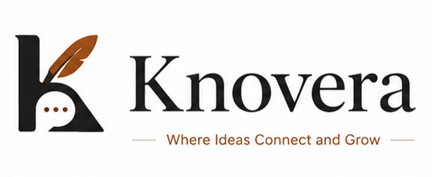
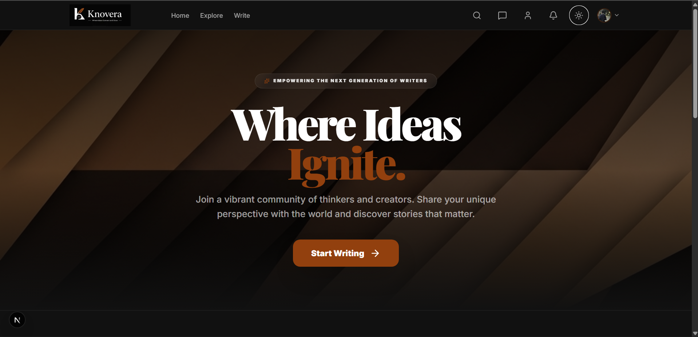
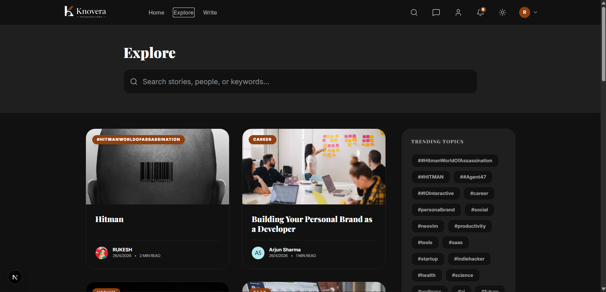
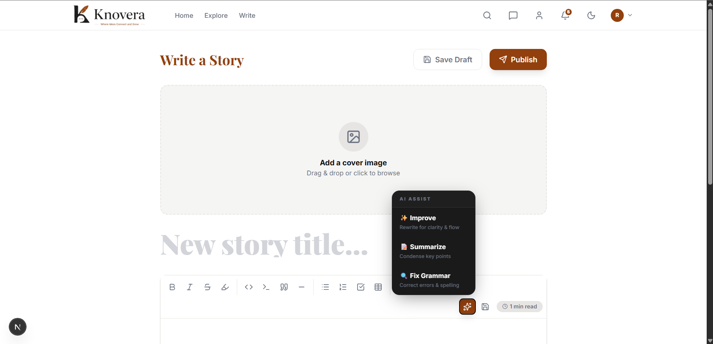
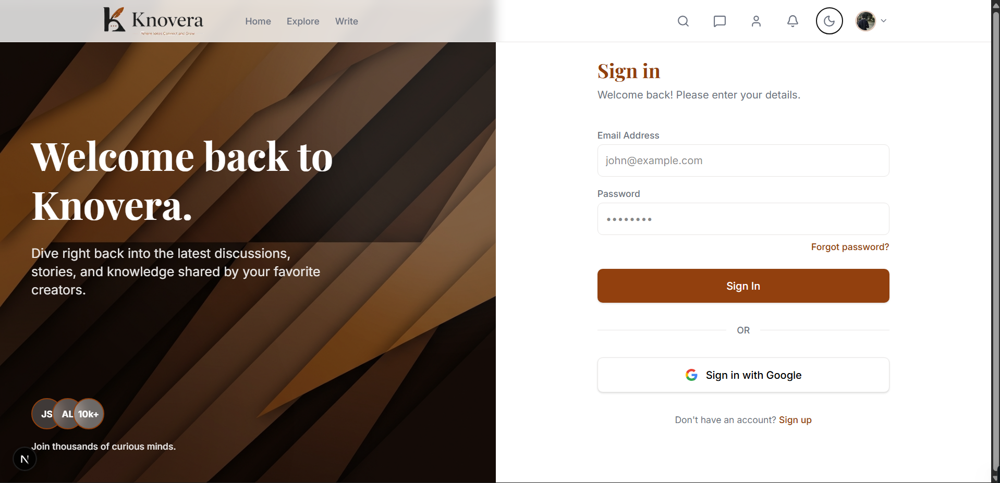
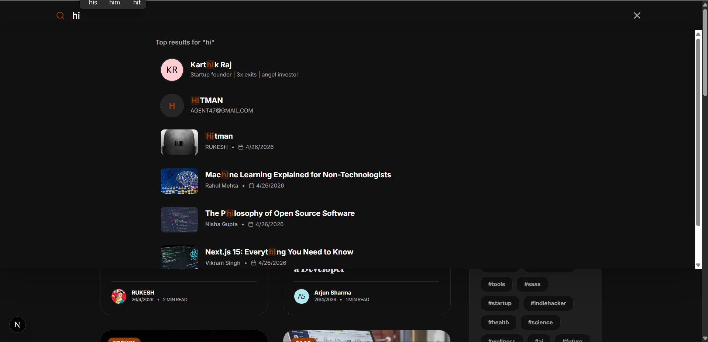
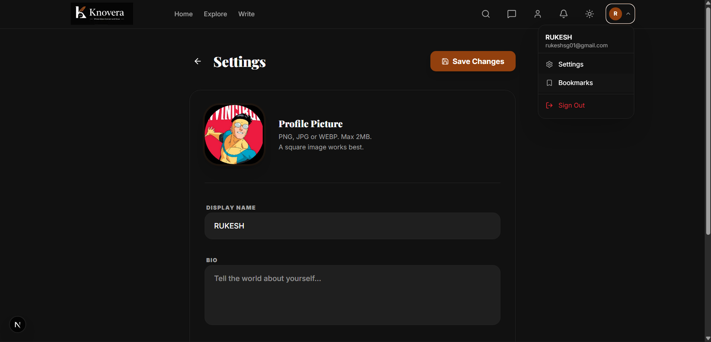
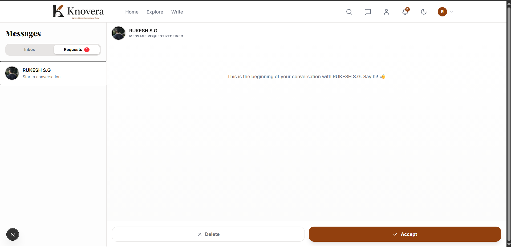

</div>

<div align="center">
  <video src="./assets/videos/knovera.mp4" width="100%" autoplay muted loop></video>
</div>

<br />

<div align="center">
  
</div>

<div align="center">
  <h3>Where Ideas Connect and Grow.</h3>
</div>

<div align="center">
  <a href="https://github.com/rukeshsg/Knovera-Community-Blogging-And-Knowledge-Sharing-Platform">
    
  </a>
  <a href="https://github.com/rukeshsg">
    
  </a>
  
</div>

<div align="center">
  
  
  
  
  
</div>


<br><br>

<div align="center">

  <h3>Experience Knovera Live</h3>

  <p>
    Explore the community blogging platform in action and see how ideas connect and grow.
  </p>

  <a href="https://knovera-community-blogging-and-knowledge-sharing-lnxfl7k3a.vercel.app" target="_blank">
    
  </a>


---

<div align="center">

  <!-- Title -->
  <h1>Knovera Platform</h1>

  <!-- Subtitle -->
  <p>
    <strong>Interactive Product Preview</strong>
  </p>

  <!-- Description -->
  <p>
    Experience the platform in action. Click the preview below to watch the full demo video.
  </p>

  <!-- Preview Image -->
  <a href="https://youtu.be/dAfPCiXs9QU" target="_blank">
    
  </a>

  <!-- Optional Caption -->
  <p>
    <sub>▶ Click the preview to watch the full demo on YouTube</sub>
  </p>

</div>

## 🌟 Overview

**Knovera** is a premium, feature-rich blogging and community platform designed for the next generation of thinkers and writers. Built with a "quality-first" mindset, it combines modern engineering with a warm, minimalist aesthetic to provide a distraction-free environment for knowledge sharing.

Whether you are a professional creator or a casual reader, Knovera offers a polished suite of tools—including an AI-assisted editor, real-time messaging, and a robust community ecosystem—to help your ideas reach the right audience.

---

## 🚀 Key Features

### 🖋️ Advanced Writing Suite
- **AI Assist**: Built-in AI integration for grammar correction, content summarization, and writing improvements.
- **Enhanced TipTap Editor**: A custom-built, auto-expanding toolbar with support for code blocks, tables, highlights, and YouTube embeds.
- **Draft Management**: Automatic background saving ensuring you never lose your progress.
- **Read Time Estimation**: Intelligent calculation of reading time based on word count.
- **Cover Photos**: Beautiful, high-resolution cover image support powered by Cloudinary.

### 👥 Community & Engagement
- **Follow System**: Build your audience with a robust follow/unfollow system and private profile options.
- **Interaction Loop**: Engage with content through nested comments, replies, and "hearts" (likes).
- **Bookmarks**: Save your favorite stories to a personalized reading list for later access.
- **Social Integration**: Rich profiles featuring bios, social links (Twitter, GitHub, Website), and customizable banners.

### 💬 Real-time Messaging
- **Secure Communication**: Direct messaging with "Message Request" filtering to prevent spam.
- **Live Notifications**: Real-time alerts for likes, follows, comments, and new messages.

### 🔍 Discovery & Search
- **Smart Search**: Find posts and users instantly with an optimized search engine.
- **Explore Feed**: Discover trending topics and the latest stories from the community.

---

## 🛠️ Tech Stack & Architecture

### Frontend
- **Framework**: Next.js 16 (App Router) + React 19
- **Styling**: Tailwind CSS 4.0 (Vanilla CSS architecture)
- **Editor**: TipTap 3.0 (ProseMirror based)
- **Icons**: Lucide React

### Backend
- **Database**: MongoDB with Mongoose ODM
- **Auth**: NextAuth.js (Credentials & Google OAuth 2.0)
- **File Storage**: Cloudinary (Image optimization & delivery)
- **Communication**: Nodemailer (SMTP for transactional emails)

### Security & DevOps
- **Rate Limiting**: Custom middleware-based rate limiting for authentication and API endpoints.
- **Sanitization**: `isomorphic-dompurify` for safe HTML rendering.
- **Performance**: Edge-ready routes and optimized production builds.

---

## 🎨 Preview

<div align="center">
  <table>
    <tr>
      <td><br /><sub><b>Discovery Interface</b></sub></td>
      <td><br /><sub><b>AI-Assisted Editor</b></sub></td>
    </tr>
    <tr>
      <td><br /><sub><b>Secure Authentication</b></sub></td>
      <td><br /><sub><b>Smart Search</b></sub></td>
    </tr>
    <tr>
      <td><br /><sub><b>Personalized Settings</b></sub></td>
      <td><br /><sub><b>Secure Messaging</b></sub></td>
    </tr>
  </table>
</div>

---

## 🔐 Authentication & Security

Knovera employs a multi-layered security approach:
1.  **Dual Auth**: Choose between secure Credentials (email/password) or one-click Google Login.
2.  **OTP Reset**: 6-digit cryptographically random OTP flow for secure password recovery.
3.  **Input Protection**: Global sanitization against XSS and strict rate limiting to prevent brute-force attacks.
4.  **JWT Sessions**: Stateless session management for performance and security.

---

## 📂 Project Structure

```text
src/
├── app/               # Next.js App Router (Pages & API)
│   ├── api/           # Backend routes (Auth, Posts, AI, Messaging)
│   └── (routes)/      # Client-side pages
├── components/        # Reusable UI components & Editor
├── lib/               # Shared utilities (DB, Auth, API Safety)
├── models/            # Mongoose schemas (User, Post, Notification)
└── styles/            # Global design system & Tailwind tokens
public/
└── assets/            # Static branding & UI images
```

---

## ⚡ Setup & Installation

### Prerequisites
- Node.js 20+
- MongoDB instance (local or Atlas)
- Cloudinary account

### Local Development
1. **Clone the repository**
   ```bash
   git clone https://github.com/rukeshsg/Knovera-Community-Blogging-And-Knowledge-Sharing-Platform.git
   cd knovera
   ```

2. **Install dependencies**
   ```bash
   npm install
   ```

3. **Configure Environment Variables**
   Create a `.env.local` file in the root:
   ```env
   # Database
   MONGODB_URI=your_mongodb_connection_string

   # Authentication
   NEXTAUTH_SECRET=your_random_secret
   GOOGLE_CLIENT_ID=your_id
   GOOGLE_CLIENT_SECRET=your_secret

   # Storage
   CLOUDINARY_CLOUD_NAME=your_name
   CLOUDINARY_API_KEY=your_key
   CLOUDINARY_API_SECRET=your_secret

   # Email (Nodemailer)
   EMAIL_SERVER_HOST=your_host
   EMAIL_SERVER_PORT=587
   EMAIL_SERVER_USER=your_user
   EMAIL_SERVER_PASSWORD=your_password
   EMAIL_FROM=noreply@knovera.com
   ```

4. **Run the development server**
   ```bash
   npm run dev
   ```

---

## 🔮 Future Roadmap
- [ ] Integration with more AI providers (OpenAI, Gemini Pro).
- [ ] Voice-to-text writing capabilities.
- [ ] Premium subscription models for creators.
- [ ] Analytics dashboard for post performance.

---

## 📄 License

This project is proprietary and protected.

You may view and learn from the code, but you are not allowed to copy, modify, or use it commercially.
The UI/UX, branding, and design system are strictly protected.

---

<div align="center">
  <h3>Built with ❤️ by Rukesh SG</h3>
  <br />
  <a href="https://github.com/rukeshsg">
    
  </a>
  &nbsp;&nbsp;
  <a href="https://www.linkedin.com/in/rukesh-s-g-6531bb3b7/">
    
  </a>
</div>
